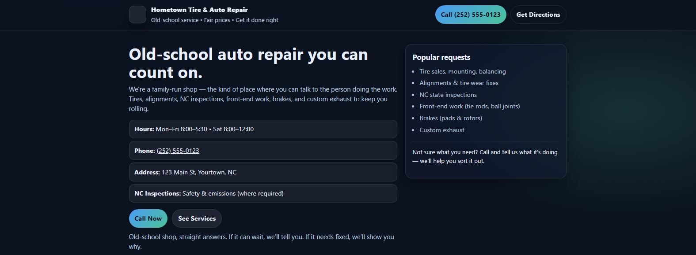
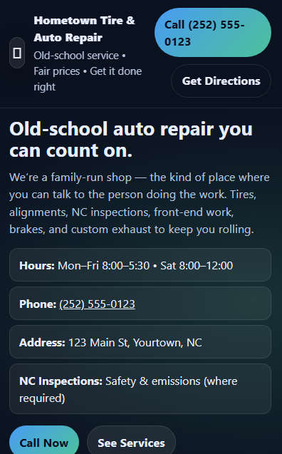
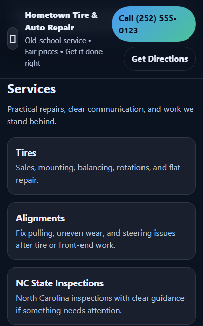

# Hometown Tire & Auto Repair — Portfolio Website

## Overview
This project is a responsive, single-page website created as a **portfolio demonstration** for a small, family-owned auto repair shop. The focus of the project is clarity, usability, and realistic small-business design rather than complex features or frameworks.

The site reflects how many real auto repair businesses operate: simple, phone-first, and easy for customers to navigate on mobile devices.

---

## Project Goals
- Build a realistic small-business website using only HTML and CSS
- Practice clean, readable structure and layout
- Design mobile-first with accessibility in mind
- Prioritize performance and simplicity
- Demonstrate professional restraint in design decisions

  ## Screenshots

### Homepage (Desktop)

The homepage establishes a clear value proposition with prominent calls to action,
making it easy for users to quickly understand services, hours, and how to contact
the shop.

### Services Overview (Desktop)

Services are presented in a clean, scannable card layout to help users quickly
identify what the shop offers without overwhelming them with text.

### Hours & Contact (Desktop)

The contact section prioritizes real-world usability, displaying hours, phone
number, address, and an embedded map to reduce friction for first-time visitors.

### FAQ / Customer Information (Desktop)

An accordion-style FAQ section answers common questions without cluttering the page,
improving usability while keeping the layout clean and focused.

### Responsive Design (Mobile)

The layout was tested and adjusted for mobile devices, ensuring readable content,
accessible calls to action, and a smooth experience on smaller screens.

Service cards reflow vertically on mobile to maintain clarity and tap-friendly
interaction.

---

## Technologies Used
- HTML5
- CSS3
  - CSS variables
  - Responsive layout techniques
  - Mobile-first styling
- GitHub Pages for hosting

No JavaScript or frameworks were used to keep the project lightweight and easy to maintain.

---

## Key Features
- Responsive, mobile-friendly layout
- Clear presentation of services, hours, and contact information
- Click-to-call phone links for mobile users
- Google Maps directions link
- Simple visual hierarchy for easy scanning
- Clean footer with portfolio disclaimer

---

## Design Approach
- Single-page layout to reflect real small-business needs
- Phone-first call-to-action instead of a contact form
- Minimal visual elements to prioritize readability and speed
- Neutral, professional color palette
- CSS variables used to allow easy theme adjustments

---

## Disclaimer
This website is a **portfolio demonstration project**.  
The business name, phone number, and address are placeholders unless otherwise noted.

---

## Future Improvements
Potential future enhancements could include:
- Additional service detail pages
- Improved accessibility features
- Local SEO enhancements such as structured data
- Image optimization for performance

---

## Author
**Aaron Williams**  
Entry-level Web Developer  

This project was created to demonstrate practical front-end skills, attention to detail, and real-world web design decision-making.
